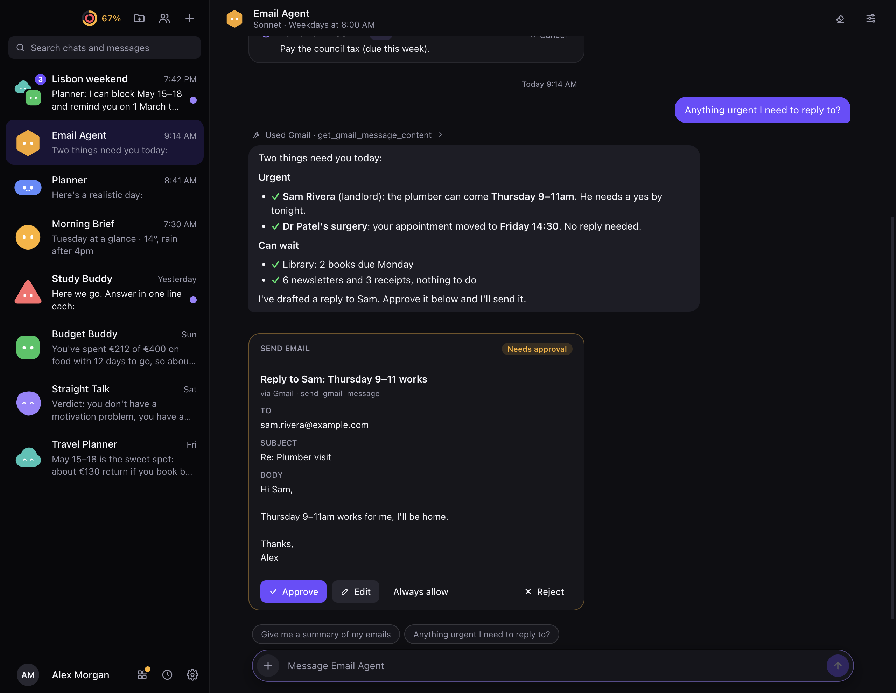
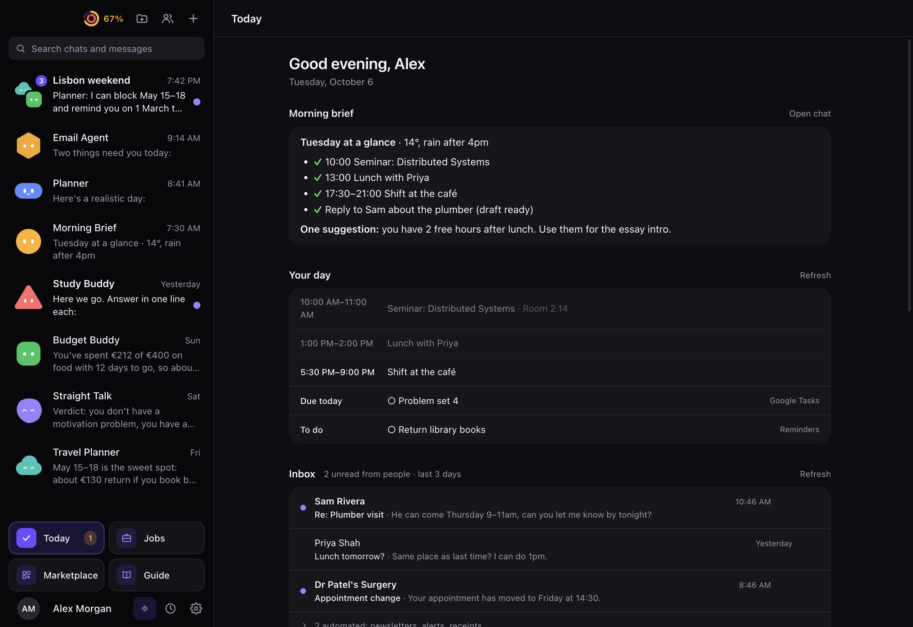
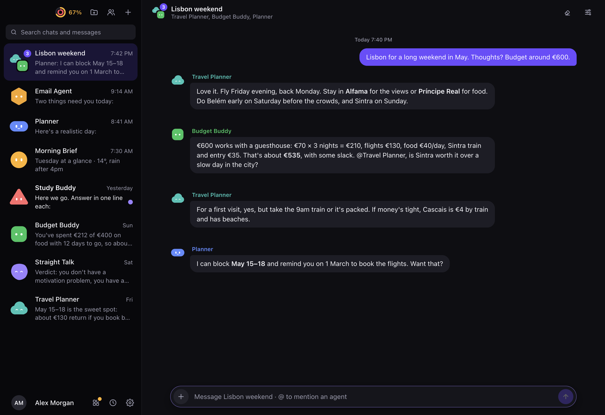
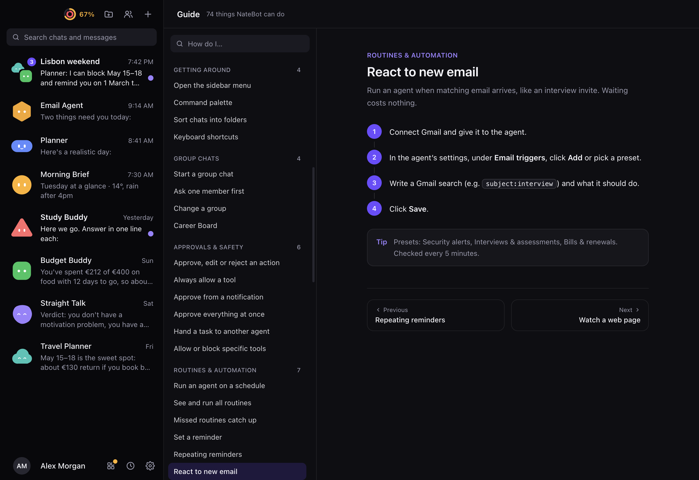

# NateBot

**A team of AI agents for everyday life, in an app that looks like Messages.**

Each contact in NateBot is an agent with a job: an Email Agent that triages your inbox, a Planner, a Research
Helper, a brutally honest mentor. You chat with them, they work on schedules and react to new email, and they
**never send, delete or pay without your OK**. It runs locally on your Mac through the Claude Code CLI you're already
signed in to, so there's **no API key and no extra bill**.

<p align="center">
  
</p>

## What it does

- **Agents you message.** Start from a template or write your own. Each agent has its own model, tools, folders it
  may read, and lasting notes about you that survive resets. Put several in a **group chat** and they'll discuss
  with each other.
- **You approve the risky parts.** Agents propose actions (send this email, add this event) as cards you can
  **Approve, Edit or Reject**, in the app or straight from the notification. An approved run can use only that one
  tool.
- **Works without being asked.** **Routines** on a schedule, **reminders** you set in plain English, **email
  triggers** that fire when matching mail arrives, **page watches** for websites that change, and **handoffs**
  between agents. Waiting for email and page changes costs no usage.
- **Your day on one screen.** **Today** gathers waiting approvals, your calendar and tasks, a people-first Gmail
  inbox, an optional morning brief, and a job-application tracker. Reading Gmail, calendar and tasks there uses no
  Claude usage.
- **Connects to your stuff.** Gmail, Google Calendar, Tasks and Drive, Apple Reminders and Notes, any MCP server,
  and Agent Skills from a built-in marketplace.
- **Reachable from anywhere.** **⌥Space** quick capture over any app, the menu bar, the macOS Share menu, ⌘K, and
  your phone through ntfy (notifications, approvals and messages to your agents).
- **Light on your limit.** Live usage rings, per-agent usage, Haiku-powered light routines, fresh sessions for long
  chats, and routines that pause automatically as your weekly limit fills up.

Everything is listed with short steps in the app's **Guide** (sidebar menu, or **⌘/**).

<table>
  <tr>
    <td width="33%"></td>
    <td width="33%"></td>
    <td width="33%"></td>
  </tr>
  <tr>
    <td align="center"><b>Today</b>: your day, inbox and approvals</td>
    <td align="center"><b>Group chats</b>: agents work it out together</td>
    <td align="center"><b>Guide</b>: steps for every feature</td>
  </tr>
</table>

<sub>Screenshots use made-up demo data (see <a href="docs/development.md#screenshots">Screenshots</a>).</sub>

## How it's built

- Every agent turn is a local `claude -p` run with your claude.ai login. NateBot strips `ANTHROPIC_*` variables so it
  can never fall back to API billing, and never calls the API itself.
- Agents are sandboxed: each has its own working folder, only the MCP servers you tick, a short list of built-in
  tools, and no permission prompts (anything that would need one is refused).
- All your data (chats, agents as YAML, settings and daily backups) lives in `~/NateBot` on your Mac.
- Electron, React, TypeScript, Tailwind and SQLite (`node:sqlite`).

More in [How it works](docs/how-it-works.md).

## Install

You need a Mac with Apple Silicon and [Claude Code](https://code.claude.com) installed and logged in with a Claude
**Pro or Max** plan (`claude auth status` should show `"loggedIn": true`).

1. Build it with Node 22+:
   ```bash
   npm install
   npm run dist
   ```
2. Open `dist/NateBot-<version>-arm64.dmg` and drag **NateBot** onto **Applications**.
3. Launch it. If macOS blocks a downloaded copy, right-click it in Applications → **Open** → **Open**.

Closing the window keeps NateBot in the menu bar so routines keep running. Turn on **Settings → Launch at login**,
and open the **Guide** to get going. Gmail and the other Google connectors need a free Google Cloud OAuth client,
which takes about 5 minutes to set up: see [Connections](docs/connections.md).

## Documentation

| | |
|---|---|
| [Features](docs/features.md) | Full reference: agents, group chats, approvals, routines, reminders, triggers, Today, usage |
| [Connections](docs/connections.md) | Setting up Gmail, Google Calendar/Tasks/Drive, Apple Reminders & Notes, MCP servers |
| [How it works](docs/how-it-works.md) | Subscription setup, agent isolation, keeping usage down, where data lives, limitations |
| [Development](docs/development.md) | Running from source, building, the app icon, PR workflow, project layout |
| [Troubleshooting](docs/troubleshooting.md) | Setup screen, login, Gmail connect, starting fresh |

## Good to know

- Routines run only while NateBot is running and the Mac is awake. A run missed in the last 12 hours catches up once
  on launch or wake.
- Agents share your normal Claude usage limits. Haiku agents use the least.
- NateBot is for personal use on your own Mac with your own subscription. Don't run it as a service for other people.
- The app is signed ad hoc, not notarised, so it can't auto-update.
